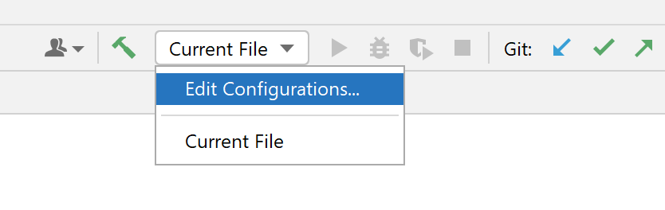
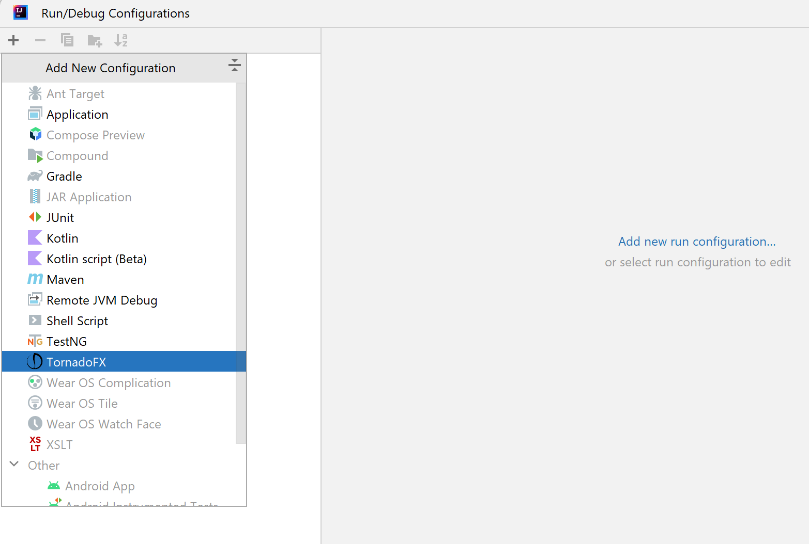
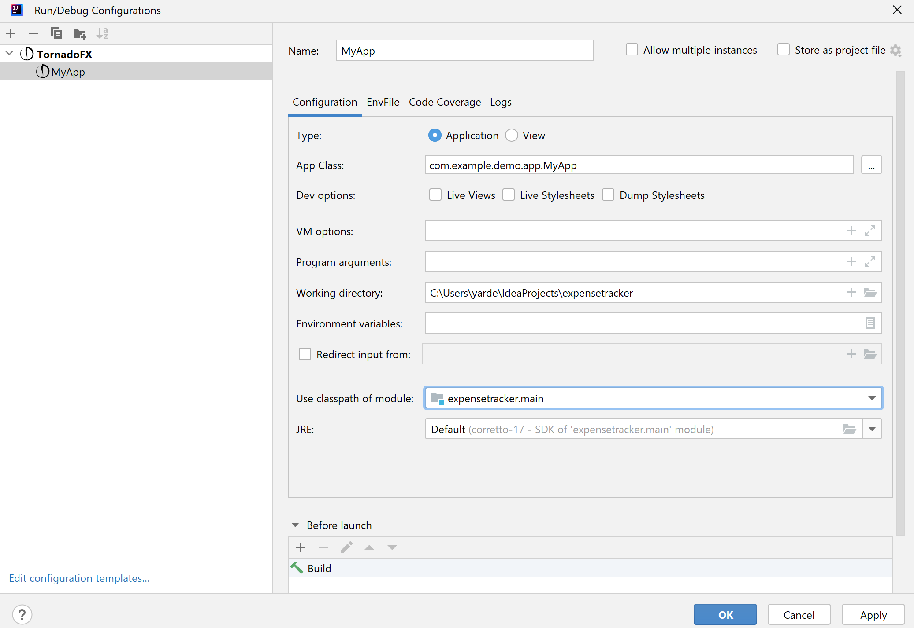

# Expense Tracker

* Expense Tracker is a small desktop application that helps you 
track your expenses using TornadoFX and REST api. 
It provides a user-friendly interface for managing expenses and generating reports.

# Getting started:

## Prerequisites

* Before running the Expense Tracker application, make sure you have the following software installed:

### 1) Intellij IDEA
* Recommended to use JetBrains [Intellij IDEA](https://www.jetbrains.com/idea/promo/?source=google&medium=cpc&campaign=9730674410&term=intellij&content=602143185271&gad=1&gclid=Cj0KCQjwjryjBhD0ARIsAMLvnF-p0O6UrKosiWUbXL_rDBP30EcjXW-9wZmxI3hwmJCPvaSRTUzldYYaArNtEALw_wcB)
* Works with both free Community edition and paid Ultimate edition.

### 2) JDK 1.8
* Download externally and use [JDK 1.8 (a.k.a JDK 8)](https://www.oracle.com/java/technologies/downloads/#java8).
* Important not to use the JDK that Intellij recommends to download, but rather get from this link ↑.

### 3) TornadoFX 
* Download [TornadoFX Plugin](https://plugins.jetbrains.com/plugin/8339-tornadofx).
* You can also just go to `setting`  (ctrl + alt + s) → `Plugins` → search for `TornadoFX` and `install`

### 4) Kotlin
* Download [Kotlin Plugin](https://plugins.jetbrains.com/plugin/6954-kotlin).
* You can also just go to `setting`  (ctrl + alt + s) → `Plugins` → search for `Kotlin` and `install`

## Configure
* Go to `Edit Configurations` (On the top row click: `Run` → `Edit Configurations`).

* Click the small `+` sign and choose: `TornadoFx`.

* Give the new run configuration a name of your choice (e.g. `MyApp`).
* In the `Use classpath of module:` choose: `ExpenseTracker.main`.
* Then in the `App Class:` click the three dots and choose: `com.example.demo.app.MyApp`.

special thanks to the [MVN Repository](https://mvnrepository.com/search?q=jetBrains+exposed) site